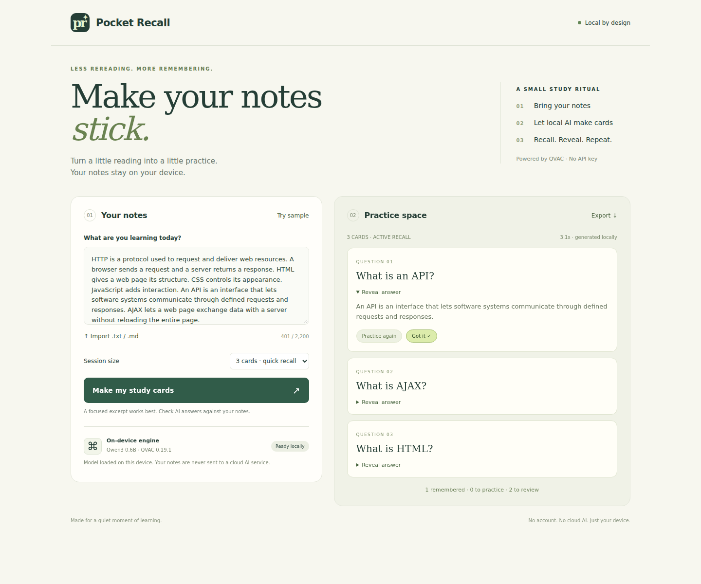

# Pocket Recall

Paste in some study notes, make a few flashcards, and test what you remember.

Pocket Recall runs Qwen3 0.6B on your computer through QVAC. No AI API key needed, and your notes aren't sent to a cloud AI service.

## App bio

**Pocket Recall is a local-first study app that turns short notes into AI-generated flashcards with QVAC.** Practice active recall, reveal answers, mark what you know, retry what you miss, and export your cards as Markdown — while inference stays on your own computer.



## Run it

You'll need Node.js 22.17+, npm 10.9+, and Python 3.10+. The first setup downloads a model of about 382 MB. For OS support and Vulkan setup, see [QVAC's system requirements](https://docs.qvac.tether.io/system-requirements/).

```sh
git clone https://github.com/adeebkjan11-ctrl/pocket-recall.git
cd pocket-recall
npm ci
```

Then follow the steps for your system.

### Windows (PowerShell)

```powershell
py -3 -m venv .venv
.\.venv\Scripts\python.exe -m pip install -r requirements.txt
.\.venv\Scripts\python.exe scripts/download-model.py
$env:QVAC_PYTHON = (Resolve-Path .\.venv\Scripts\python.exe).Path
npm run start:python
```

### macOS / Linux

```sh
python3 -m venv .venv
source .venv/bin/activate
python -m pip install -r requirements.txt
python scripts/download-model.py
npm run start:python
```

Open [http://127.0.0.1:8787](http://127.0.0.1:8787) in a browser on the same computer. Keep the terminal open while you use the app.

## Using it

1. Click **Download & prepare model**.
2. Paste 40–2,200 characters of notes, import a `.txt` or `.md` file, or click **Try sample**.
3. Choose 3 or 5 cards and click **Make my study cards**. Try answering before you hit **Reveal answer**, then mark **Got it** or **Practice again**.
4. Use **Export** to save your cards and review marks as Markdown.

The terminal shows short loading, generating, and completion messages. Notes aren't printed there.

Refreshing the page clears the session, so export anything you want to keep. Check the answers against your notes—the model can get things wrong.

## QVAC

Both SDKs are pinned to **0.19.1**: `@qvac/sdk` in `package.json` and `tetherto-qvac-sdk` in `requirements.txt`. The model is **Qwen3 0.6B Q4_0**.

### QVAC functions called by Pocket Recall

The main QVAC inference call is **`completion()`**. Pocket Recall also calls QVAC's model lifecycle and cancellation functions.

| QVAC function | Backend / file | How Pocket Recall uses it |
| --- | --- | --- |
| `loadModel()` | JavaScript · `src/engine-node.js` | Loads Qwen3 0.6B before generation. |
| `completion()` | JavaScript · `src/engine-node.js` | Generates flashcard text locally from the study-note prompt. |
| `cancel()` | JavaScript · `src/engine-node.js` | Stops an active generation or a timed-out request. |
| `unloadModel()` | JavaScript · `src/engine-node.js` | Releases the loaded model during shutdown. |
| `load_model()` | Python · `src/python-worker.py` | Loads the same local Qwen3 model through QVAC's Python SDK. |
| `completion()` | Python · `src/python-worker.py` | Runs local text generation for each flashcard request. |
| `cancel()` | Python · `src/python-worker.py` | Cancels active or timed-out generation. |
| `unload_model()` | Python · `src/python-worker.py` | Unloads the model during shutdown. |

With the tested `npm run start:python` path, the app loads the model with `load_model()` and calls `completion()` whenever you generate study cards. The JavaScript backend provides the equivalent `loadModel()` + `completion()` flow.

Python is the tested backend used for the screenshot. You can also start the JavaScript backend with `npm start`; if it hits a socket-permission error, use the Python setup above.

## Checks

```sh
npm test               # validation and HTTP checks; no model needed
npm run smoke:python   # generate cards with the local model
```

See the [run notes](docs/VERIFICATION-CURRENT.md) for recorded results and sample output.

Built with Codex. [MIT license](LICENSE) · [Project post on X](https://x.com/MrLazy78922/status/2102048795198632136)
